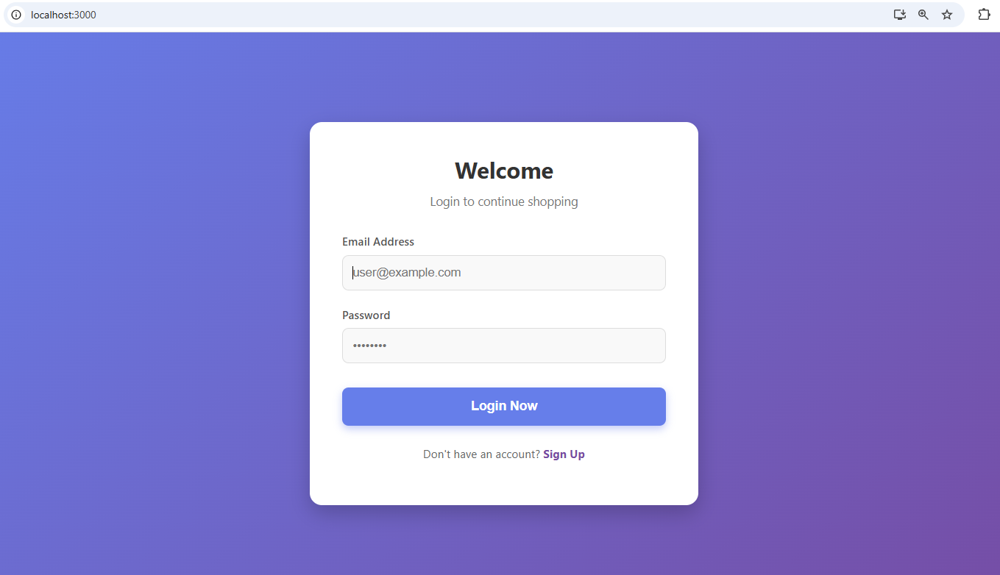
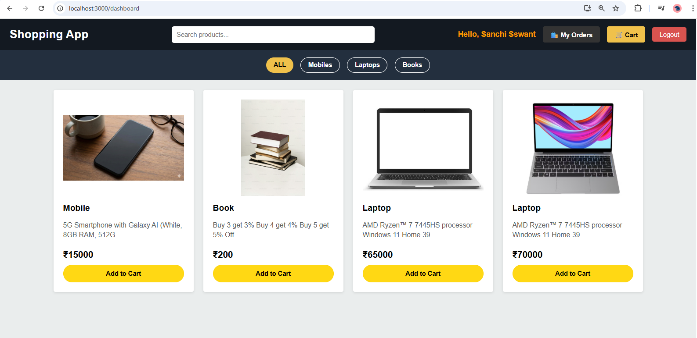
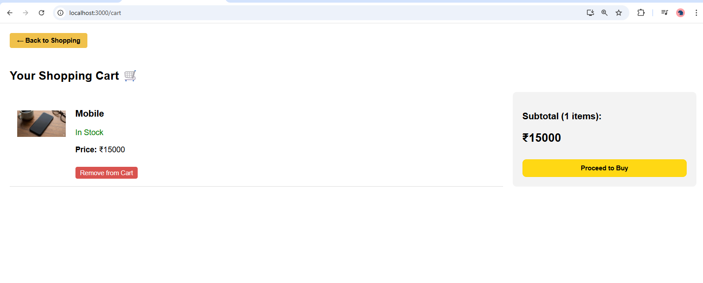
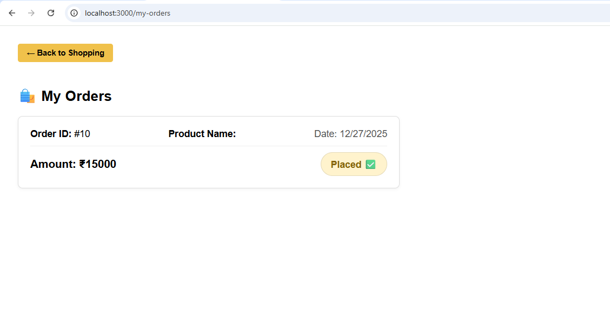
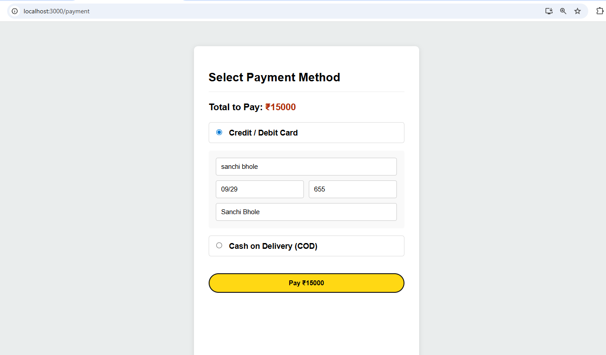
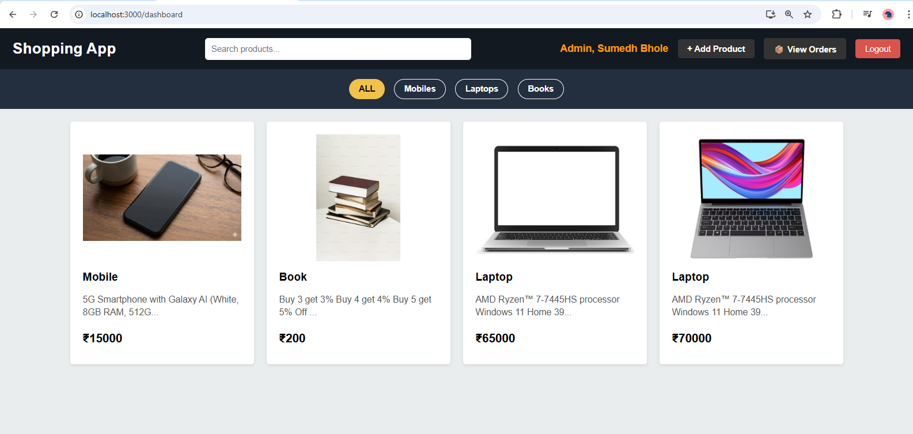
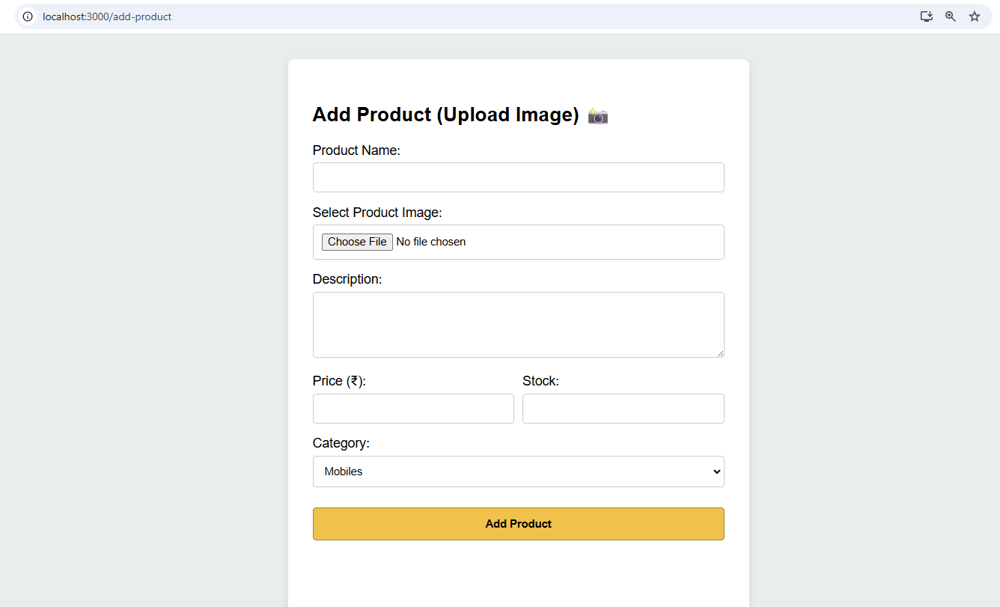
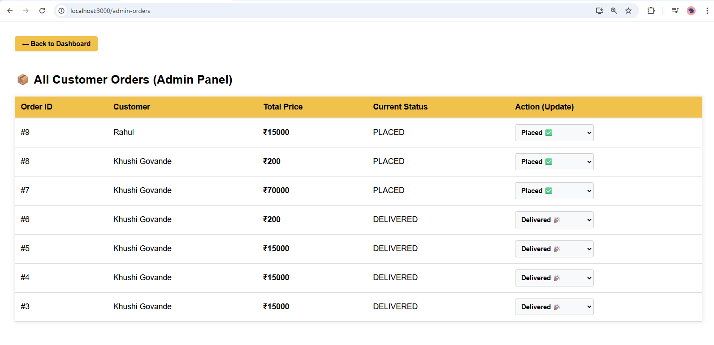

# 🛒 Shopping App - Inspired by Amazon

Trying to build the simple shopping app. This project features a robust **Spring Boot** backend and a dynamic **React.js** frontend, showcasing full CRUD operations and secure user workflows.

---

## 📸 Visual Overview (Project Screenshots)

Below are the key interfaces of the application. Click on each image to view them in full resolution.

  
  
  
  
  
  
  
  

---

## 🛠 Technical Stack

### **Frontend**
* **Core :** React.js, HTML5, CSS3
* **Styling:** Bootstrap 5 (for responsive design)

### **Backend**
* **Framework:** Spring Boot (Java)
* **Data Layer:** Spring Data JPA
* **Database:** PostgreSQ
* **API Style:** RESTful Services

---

## 🚀 Key Functionalities

### **User Module**
* **Authentication:** Secure login and registration.
* **Cart System:** Add/remove items with real-time price calculation.
* **Order Management:** Detailed order history and status tracking.

### **Admin Module**
* **Inventory Control:** Add products dynamically.
* **Order Supervision:** Monitor and update status for all customer orders.

---

## ⚙️ Installation & Setup

## 👨‍💻 Author
**Sumedh Bhole** [GitHub Profile](https://github.com/sumedhbhole)
